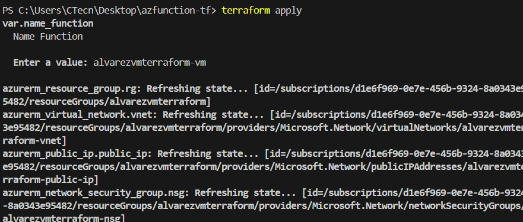
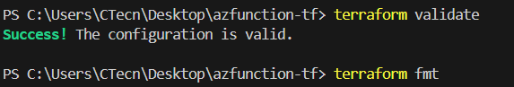
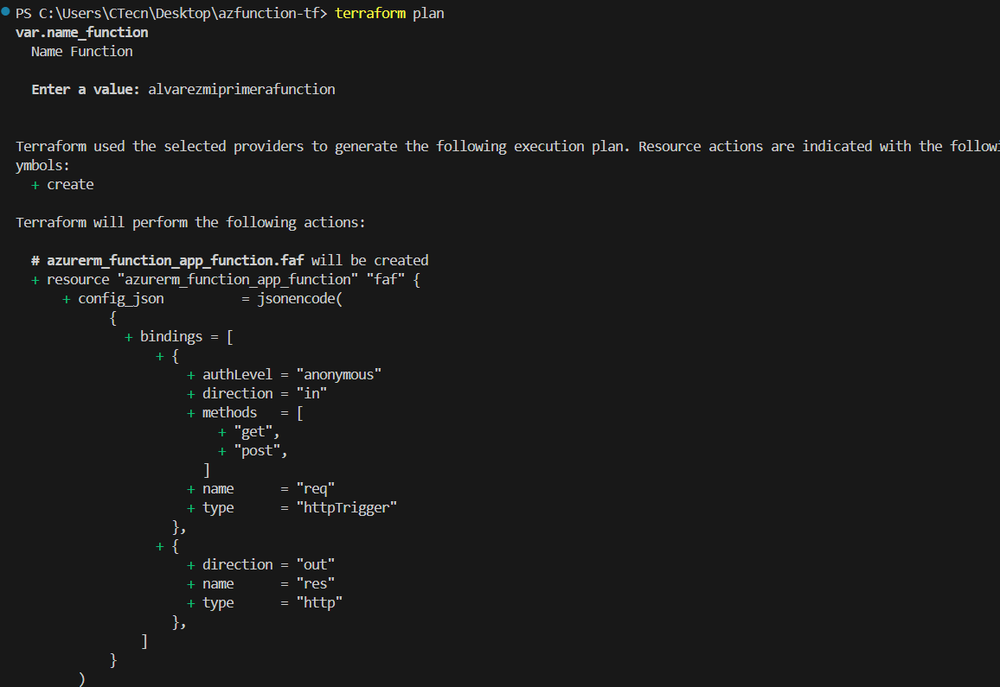
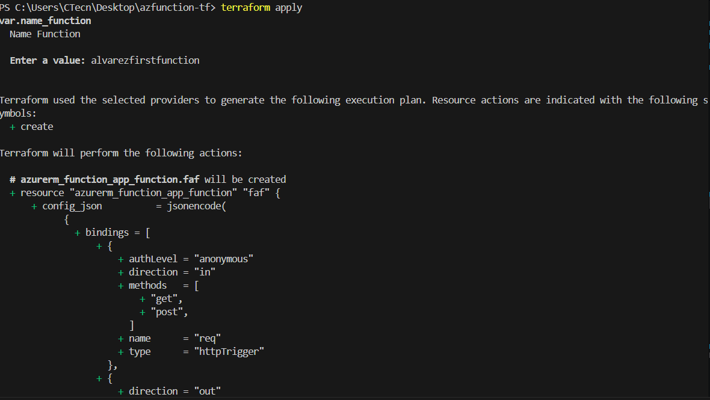
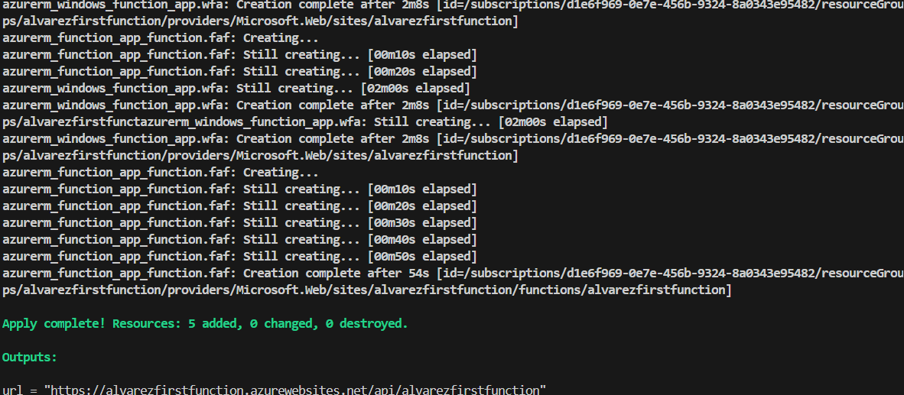
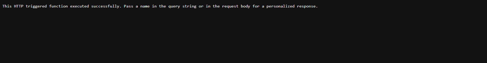
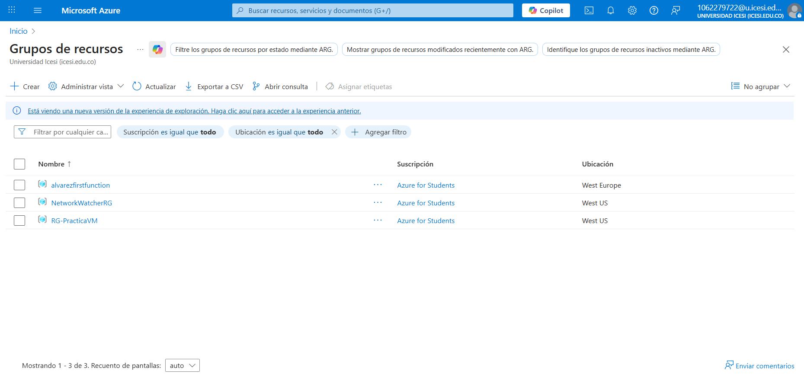
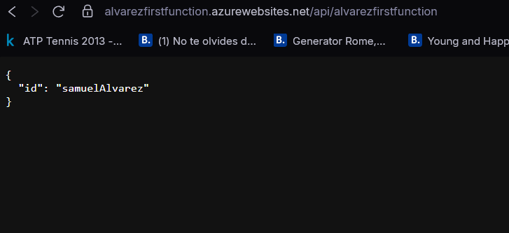

## informe para subir una funcion con terraform a azure
## estudiante: Samuel Alvarez Alban A00394750

1) logearse en azure CLI con el comando az login

2) ver el id de la subcripcion del usuario de azure y remplazarlo en el main

3) listo ahora ya procedemos a subir nuestra primera funcion

terraform init: Inicializa el proyecto Terraform y descarga los proveedores necesarios.

terraform validate: Verifica que la configuración de Terraform sea válida.

terraform fmt: Formatea el código Terraform siguiendo las convenciones estándar

terraform plan: Muestra los cambios que Terraform realizará en la infraestructura.

terraform apply: Aplica los cambios y crea/modifica la infraestructura según la configuración.

este es el link que arroja despues de hacer apply

y aqui se encuentra la function en el grupo de recursos

la funcion es alvarezfirstfunction.

aqui una prueba

