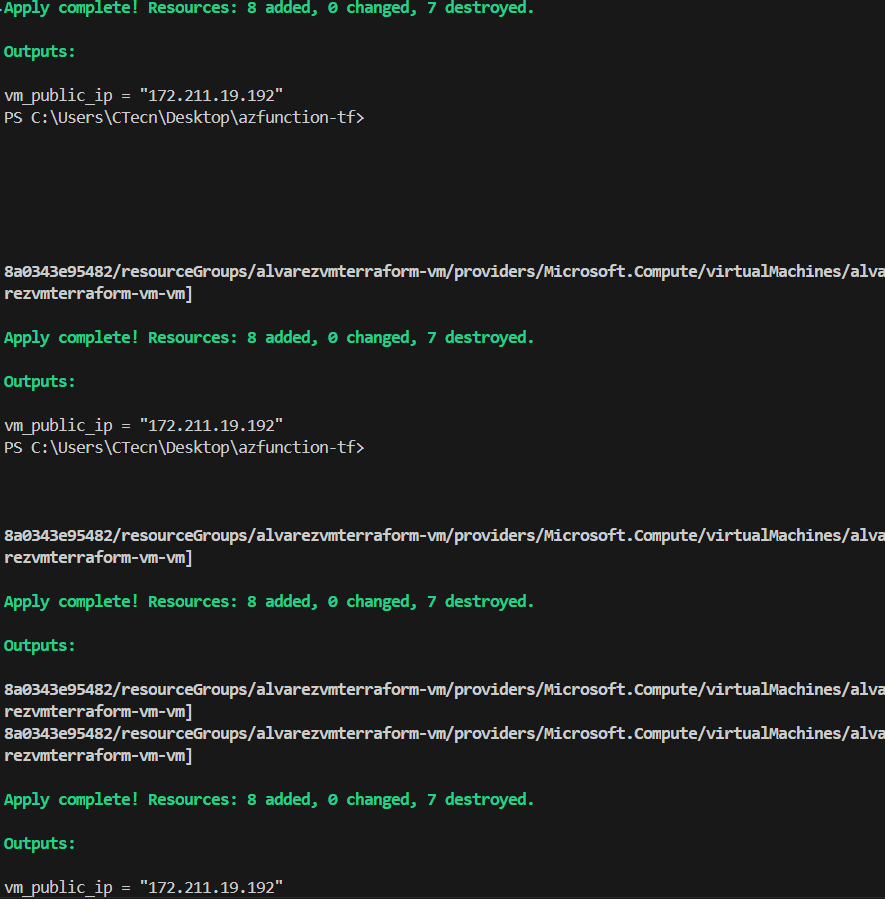
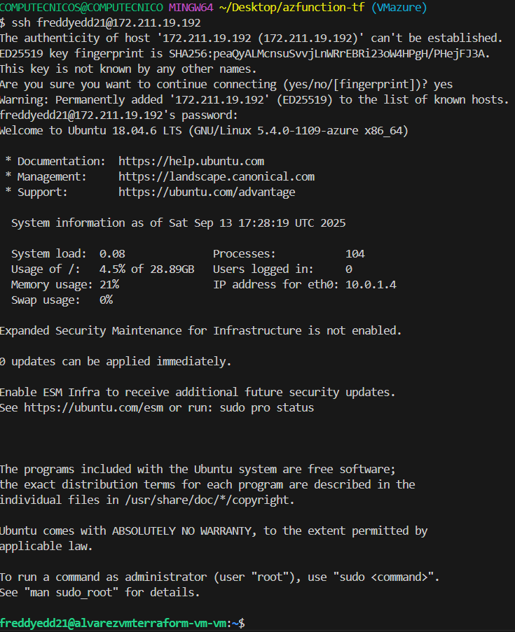
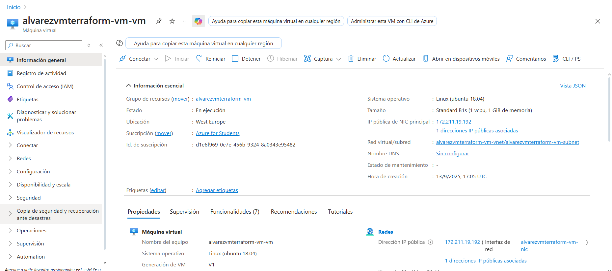

# Crear una Máquina Virtual en Azure con Terraform

Este proyecto muestra cómo desplegar una máquina virtual Linux en Azure usando Terraform.

## Pasos realizados

1. **Configuración de archivos Terraform**
   - Se definieron los recursos en `main.tf`:
     - Grupo de recursos
     - Red virtual y subred
     - IP pública
     - Interfaz de red
     - Seguridad de red
     - Máquina virtual Linux

2. **Variables y salidas**
   - Se usó `variables.tf` para definir variables como el nombre de la VM.
   - Se configuró `outputs.tf` para mostrar la IP pública de la VM.

3. **Inicialización y despliegue**
   - Ejecuta:
     ```powershell
     terraform init
     terraform plan
     terraform apply
     ```
   - Ingresa el nombre de la función/VM cuando se solicite.

4. **Conexión a la VM**
   - Obtén la IP pública desde la salida de Terraform o con:
     ```powershell
     terraform output vm_public_ip
     ```
   - Conéctate por SSH:
     ```powershell
     ssh freddyedd21@<IP_PUBLICA>
     ```
     Usa la contraseña definida en `main.tf`.

## Dónde mostrar capturas

- **Captura 1:** Salida exitosa de `terraform apply` mostrando la creación de recursos.
- **Captura 2:** Conexión exitosa por SSH a la VM desde PowerShell o terminal.
- **Captura 3 (opcional):** Portal de Azure mostrando la VM creada.

Coloca las imágenes en la carpeta del proyecto y referencia aquí si lo deseas:

```



```

## Recomendaciones
- Cambia la contraseña por una segura antes de producción.
- Usa autenticación SSH para mayor seguridad.

---

Cualquier duda, revisa los archivos `.tf` o consulta la documentación oficial de Terraform y Azure.
